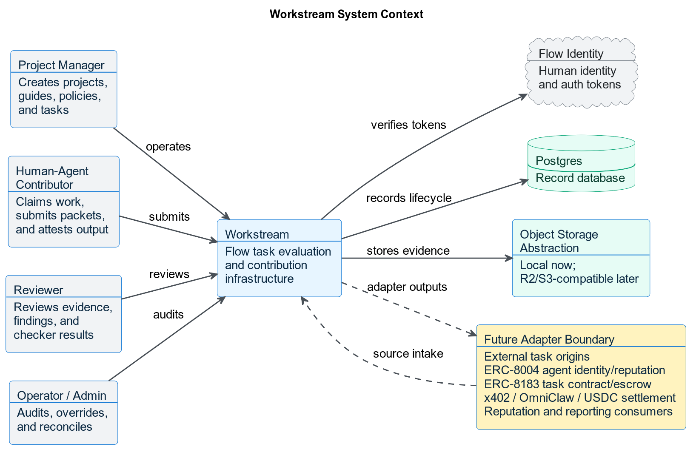
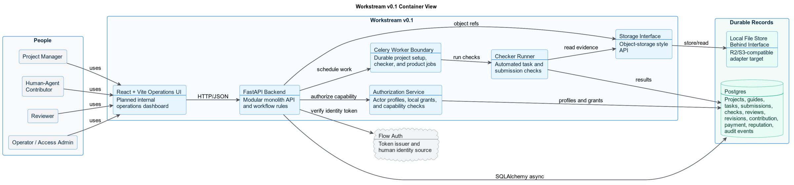
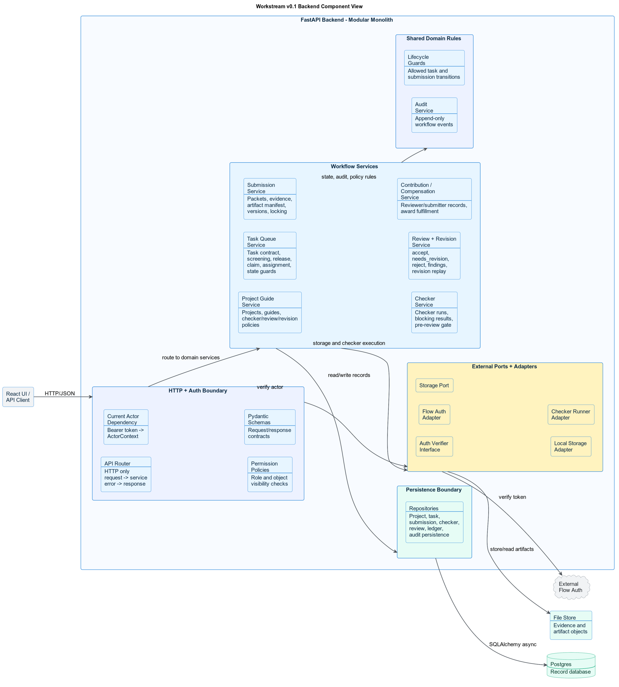
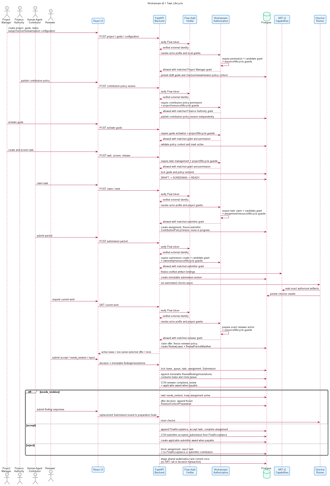
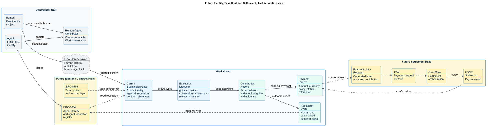

<section class="cover">

# Workstream Architecture Brief

<div class="line"></div>

<p class="subtitle">Flow task evaluation and contribution infrastructure</p>

Workstream manages project guides, task queues, submission packets, automated
checks, reviewer routing, evaluation sprints, revision loops, contribution
records, compensation fulfillment/payment status, and reputation signals.

Workstream is how Flow measures, certifies, and coordinates useful human-agent work.

<p class="meta">Scope: v0.1 first 30 days, with future adapter context for identity, task contracts, settlement, and reputation.</p>

</section>

<div class="page-break"></div>

## Executive Summary

Workstream is the operating system for useful work inside Flow. It does not try to own every possible execution environment. Instead, it gives every project a guide, every task a locked policy context, every submission an evidence packet, every review a canonical decision and reviewer contribution, and every accepted task an additional submitter contribution before compensation and reputation events.

The first 30 days are focused on proving the internal lifecycle:

```text
Project Guide -> Task Queue -> Submission Packet -> Checks -> Review
-> Revision / Acceptance / Rejection -> Contribution Record
-> Compensation Award / Fulfillment -> Reputation Event
```

<div class="callout">
Current v0.1 is backend-first and internal-loop-first. External source adapters, agent identity writes, task escrow, x402 payment requests, OmniClaw settlement, USDC payouts, public marketplace flows, and automated routing remain adapter boundaries until the internal evaluation loop works with real tasks.
</div>

## Architecture Principles

| Principle | Meaning |
| --- | --- |
| Source-agnostic, manual-first | v0.1 accepts manual, markdown, or CSV-controlled intake. Future origins normalize into the same task contract. |
| Flow auth boundary | Workstream verifies Flow-issued tokens. It does not own login, signup, password reset, password storage, or primary sessions. |
| Modular monolith | FastAPI remains one deployable backend while keeping routers, services, repositories, ports, and adapters separate. |
| Postgres record database | Local, CI, and production-like development use Postgres as the record database. |
| Object-storage abstraction | Local filesystem storage is allowed only behind the provider-neutral `ArtifactStore`; AWS S3 is the v0.1 hosted provider and MinIO is the local/CI protocol proof. |
| Async-first execution | Long-running checker work does not block request/response paths. |
| Contribution before compensation | Every valid human review creates a reviewer contribution; accepted work additionally creates a submitter contribution. Compensation and reputation attach afterward. |

<div class="page-break"></div>

## C1: System Context

The context diagram shows Workstream as one system inside the broader Flow ecosystem. Workstream owns evaluation and records. It does not own human identity, future agent identity standards, task escrow, settlement rails, or external task origins.

<div class="diagram">
  
</div>

### What This Means

- Project managers, contributors, reviewers, and operators interact with Workstream.
- Flow identity remains the human identity and auth source.
- Postgres is the record database.
- Storage sits behind an object-storage abstraction.
- Future origins and protocol rails connect through adapters, not by becoming core Workstream logic.

<div class="page-break"></div>

<section class="landscape">

## C2: v0.1 Container View

The container view shows the first 30-day implementation. It is intentionally small: React + Vite for the planned internal operations UI, FastAPI for the backend, Postgres for records, a storage interface for artifacts, and an async checker/job boundary.

<div class="diagram wide">
  
</div>

</section>

### Container Responsibilities

| Container | Responsibility |
| --- | --- |
| React + Vite operations UI | Planned internal operations dashboard for project, task, submission, review, compensation fulfillment, and reputation workflows. |
| FastAPI backend | API contracts, workflow rules, auth dependency, lifecycle guards, module orchestration, and audit writes. |
| Celery worker boundary | Durable project setup, checker, and background product-job execution. FastAPI background tasks are not the Workstream product-job boundary. |
| Checker runner | Executes automated checks and stores checker results. |
| Storage interface | Keeps file/evidence semantics stable while local storage and the hosted AWS S3 profile implement the same provider-neutral port. |
| Postgres | Durable record database for the full Workstream lifecycle. |

<div class="page-break"></div>

## C3: Backend Component View

The backend component view zooms into the FastAPI container. It shows how the modular monolith stays clean without becoming a distributed system too early.

<div class="diagram">
  
</div>

<div class="page-break"></div>

### Backend Boundaries

| Boundary | Responsibility |
| --- | --- |
| HTTP + auth boundary | Routers handle HTTP only. Actor resolution, permission checks, and Pydantic request/response validation stay at the boundary. |
| Workflow services | Project guide, task queue, submission, checker, review/revision, and contribution/compensation/reputation services own business rules. |
| Shared domain rules | Lifecycle guards and audit writes stay shared instead of being scattered through routers. |
| Persistence boundary | Repositories own SQLAlchemy async persistence and Postgres access. |
| External ports/adapters | Flow auth, storage, and checker execution stay behind interfaces. |

<div class="page-break"></div>

## Lifecycle Sequence

The sequence below shows the narrow v0.1 loop the system must prove before expansion.

<div class="diagram sequence">
  
</div>

### Lifecycle Invariants

- New TaskAssignments and ReviewLeases cannot be created without an active
  published compensation policy version to freeze.
- A contributor submission creates a new immutable submission version; locked artifacts are not edited in place.
- Review decisions are exactly `accept`, `needs_revision`, or `reject`.
- `needs_revision` starts a revision loop and must replay prior findings.
- Every valid human review creates a reviewer contribution; accepted work
  additionally creates a submitter contribution before compensation or
  reputation records.
- Compensation fulfillment status is separate from task acceptance.

<div class="page-break"></div>

<section class="landscape">

## Future Identity, Task Contract, Settlement, And Reputation

This view explains the broader architecture direction without moving it into v0.1 scope.

<div class="diagram wide">
  
</div>

</section>

### Future Separation Of Concern

| Concern | Owner |
| --- | --- |
| Human identity and auth | Flow identity layer |
| Agent identity | ERC-8004 |
| Agent reputation read/write | ERC-8004 through a future Workstream adapter |
| Task contract and escrow reference | ERC-8183 |
| Evaluation lifecycle | Workstream |
| Accepted-work certification | Workstream contribution record |
| Compensation policy, immutable award, and fulfillment status | Workstream compensation records |
| Payment request and settlement execution | x402, OmniClaw, and USDC settlement rails |

<div class="boundary">
Future ERC-8004, ERC-8183, x402, OmniClaw, and USDC integrations do not replace Workstream. They use Workstream records. Workstream remains the evaluation, acceptance, contribution, compensation-award/fulfillment, and reputation-signal system.
</div>

<div class="page-break"></div>

## Scope Boundary

### Current v0.1 / First 30 Days

- project guide and versioned policy context
- task queue and task records
- assignment and claim flow
- submission packets and evidence
- checker framework and pre-review gate
- human review and revision replay
- contribution records
- compensation award, receipt, and fulfillment projection records
- reputation events
- audit events

### Later Adapter Boundaries

- external origin onboarding and source adapters
- automated routing
- owner-agent execution workspace
- ERC-8004 agent identity and reputation writes
- ERC-8183 task contract and escrow settlement
- x402 payment requests
- OmniClaw settlement orchestration
- USDC payout execution
- marketplace discovery

## Closing

Workstream v0.1 succeeds when it can run real internal work from project guide to reviewer/submitter contributions with evidence, checks, human review, revision discipline, conditional compensation awards, fulfillment status, and reputation events.

The system should expand only after that loop is proven.
