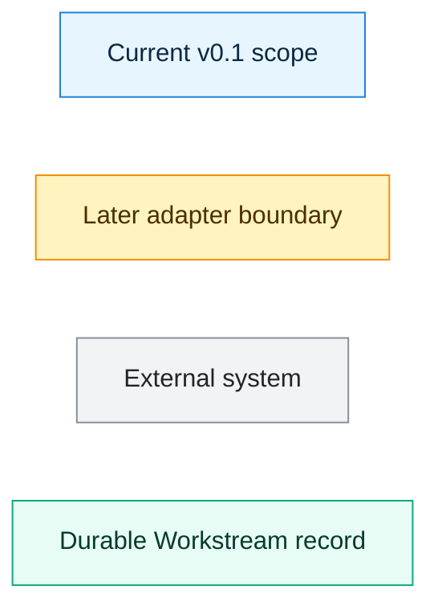

# Workstream Architecture Diagrams

This diagram pack explains Workstream at two levels:

- the 30-day v0.1 implementation that is being built now
- the broader Workstream ecosystem that can connect later to external origins, agent identity, task contracts, settlement rails, and portable reputation

The diagrams use C4-style boundaries with Mermaid flowcharts so they render directly in GitHub.

## Diagram Index

- [System Context](workstream_context.md)
- [v0.1 Container View](workstream_v01_container.md)
- [v0.1 Backend Component View](backend_v01_components.md)
- [Task Lifecycle Sequence](task_lifecycle_sequence.md)
- [Future Identity, Task Contract, Settlement, And Reputation View](future_identity_payment_reputation.md)

## Legend

## Reading Order

Start with the [System Context](workstream_context.md) to explain what Workstream is and what it does not own. Then use the [v0.1 Container View](workstream_v01_container.md) to show what is actually being implemented in the first 30 days. Use the backend component and lifecycle diagrams when the discussion moves from product architecture into implementation design.
