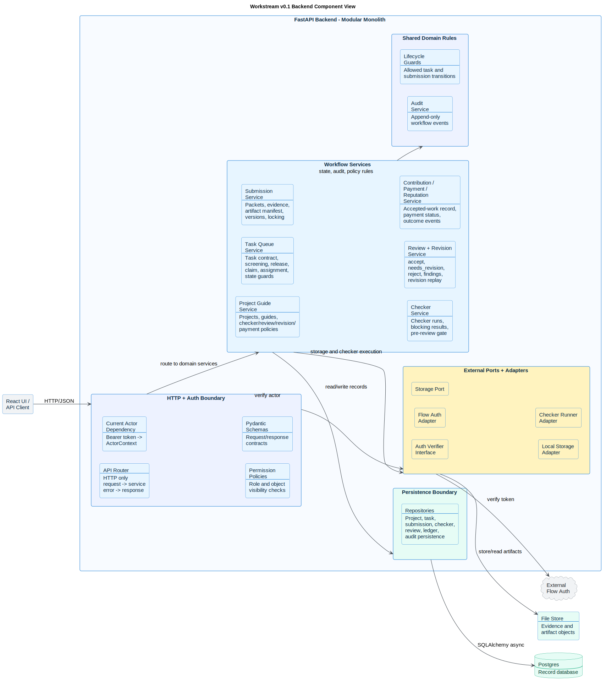

# Workstream v0.1 Backend Component View

This is the C4-PlantUML component view for the FastAPI modular monolith.

The backend stays one deployable service while keeping module boundaries strict. Routers handle HTTP, services own workflow rules, repositories own database access, schemas own API contracts, and adapters own external boundaries.



Source: [backend_v01_components.puml](backend_v01_components.puml)

## Component Contract

| Boundary | Rule |
| --- | --- |
| Routers | HTTP only: parse request, resolve actor/session, call services, map domain errors. |
| Services | Business rules: status transitions, policy locks, authorization decisions, audit intent. |
| Repositories | SQLAlchemy 2.x async persistence only; no HTTP or auth decisions. |
| Schemas | Pydantic input/output contracts and API validation. |
| Auth adapter | Verifies external Flow tokens and returns `ActorContext`. |
| Storage port | Hides local filesystem, MinIO, and AWS S3 behind stable provider-neutral artifact references. |
| Audit module | Writes append-only evidence for state changes and sensitive workflow events. |

## Current Module Priority

The first 30 days move through the loop in this order:

```text
Projects and guides
-> tasks and assignment
-> submission packets and evidence
-> checker runs
-> review and revision
-> reviewer contribution for every valid Review
-> submitter contribution only on accept
-> conditional compensation award and fulfillment status
-> reputation event
```
