# Future Identity, Task Contract, Settlement, And Reputation View

This diagram shows how the broader Workstream system can connect later to agent identity, task contract, settlement, and portable reputation rails.

This is not v0.1 implementation scope. It is the architecture direction that keeps separation of concern clear.

```mermaid
flowchart LR
  subgraph Contributor["Contributor Unit"]
    human["Human<br/>Flow identity subject"]
    agent["Agent<br/>ERC-8004 identity"]
    pair["Human-Agent Contributor<br/>Workstream treats this as one accountable workflow actor"]
    human --> pair
    agent --> pair
  end

  flowIdentity["Flow Identity Layer<br/>Human identity, auth token, human-agent link context"]
  erc8004["ERC-8004<br/>Agent identity and agent reputation registry"]
  erc8183["ERC-8183<br/>Task contract and escrow layer"]

  subgraph Workstream["Workstream"]
    gate["Claim / Submission Gate<br/>Reads policy, human identity, agent id, reputation, and task contract references"]
    lifecycle["Evaluation Lifecycle<br/>guide -> task -> submission -> checks -> review -> revision"]
    contribution["Contribution Record<br/>Accepted work under locked guide and evidence"]
    paymentRecord["Payment Record<br/>Amount, currency, policy, status, references"]
    reputationRecord["Reputation Event<br/>Human and agent-linked outcome signal"]
  end

  subgraph Settlement["Future Settlement Rails"]
    paymentLink["Payment Link / Request<br/>Generated from accepted contribution and locked payment policy"]
    x402["x402<br/>Payment request protocol"]
    omniclaw["OmniClaw<br/>Settlement orchestration"]
    usdc["USDC Stablecoin<br/>Payout asset"]
  end

  human --> flowIdentity
  flowIdentity --> gate
  agent --> erc8004
  erc8004 -.->|"Read agent identity and reputation before claim"| gate
  erc8183 -.->|"Optional task contract / escrow reference"| gate

  gate --> lifecycle
  lifecycle --> contribution
  contribution --> paymentRecord
  contribution --> reputationRecord

  paymentRecord -.->|"Accepted task creates payment request"| paymentLink
  paymentLink -.-> x402
  x402 -.-> omniclaw
  omniclaw -.->|"USDC payout execution"| usdc
  usdc -.->|"Settlement confirmation updates payment status"| paymentRecord

  reputationRecord -.->|"Accepted/rejected/revision outcome can update agent reputation"| erc8004

  classDef current fill:#e7f5ff,stroke:#1c7ed6,color:#0b2942
  classDef later fill:#fff3bf,stroke:#f08c00,color:#4a2f00
  classDef external fill:#f1f3f5,stroke:#868e96,color:#212529
  classDef record fill:#e6fcf5,stroke:#0ca678,color:#063b2c

  class gate,lifecycle current
  class contribution,paymentRecord,reputationRecord record
  class flowIdentity,human,agent,pair external
  class erc8004,erc8183,paymentLink,x402,omniclaw,usdc later
```



## Separation Of Concern

| Concern | Owner |
| --- | --- |
| Human identity and auth | Flow identity layer |
| Agent identity | ERC-8004 |
| Agent reputation read/write | ERC-8004, through a future Workstream adapter |
| Task contract and escrow reference | ERC-8183 |
| Evaluation lifecycle | Workstream |
| Accepted-work certification | Workstream contribution record |
| Payment policy and payment status | Workstream payment record |
| Payment request and settlement execution | x402, OmniClaw, USDC settlement rails |

## Future Flow

```text
Flow human identity + ERC-8004 agent identity
-> Workstream claim/submission gate
-> locked guide and policy context
-> submitted artifact packet with human id and agent id references
-> checks and human review
-> accepted contribution record
-> payment record from locked payment policy
-> payment link / x402 request
-> OmniClaw / USDC settlement
-> payment status update
-> reputation event
-> optional ERC-8004 agent reputation write
```

## Non-v0.1 Boundary

The first implementation does not build ERC-8004 writes, ERC-8183 settlement, x402 payments, OmniClaw settlement orchestration, wallet flows, public marketplace discovery, or external source adapters. These are adapter boundaries that become useful after Workstream proves the internal evaluation loop with real tasks.
