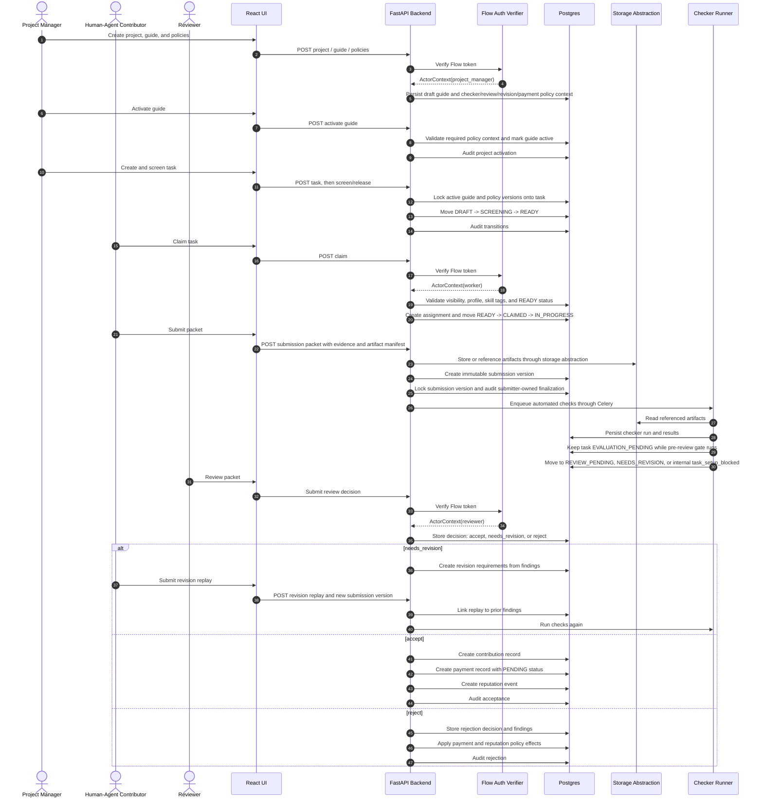

# Task Lifecycle Sequence

This sequence shows the v0.1 operating loop from project guide to accepted contribution and payment/reputation records.

It is intentionally separate from the future identity and settlement diagram. v0.1 records payment status and reputation events internally; it does not execute on-chain settlement or write portable agent reputation.

## Lifecycle Invariants

- A task cannot enter `READY` without locked guide, checker, review, revision, and payment policy context.
- A worker submission creates a new immutable submission version; locked artifacts are not edited in place.
- Review decisions are exactly `accept`, `needs_revision`, or `reject`.
- `needs_revision` starts a revision loop and must replay prior findings.
- Accepted work creates a contribution record before payment or reputation records.
- Payment status is separate from task acceptance.
