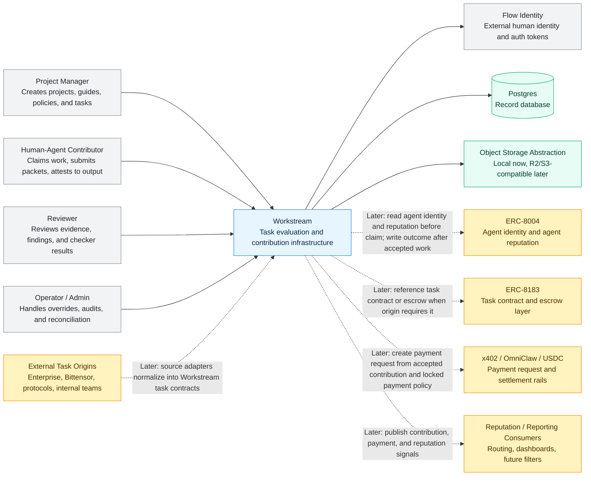

# Workstream System Context

This is the C4-style context view. It shows Workstream as one system inside the broader Flow ecosystem.

The diagram intentionally separates current v0.1 scope from future adapter boundaries. Workstream owns evaluation, contribution records, payment status, and reputation signals. It does not own Flow login, agent identity standards, escrow contracts, settlement rails, or external task origins.

## Context Rules

- Flow identity is the human identity and auth boundary.
- Workstream verifies Flow-issued tokens; it does not own login, signup, password reset, password storage, or primary auth sessions.
- Workstream treats a working contributor as a human-agent unit for workflow purposes, while preserving separate human and agent references when agent identity is introduced.
- ERC-8004 is the future agent identity and agent reputation rail.
- ERC-8183 is the future task contract and escrow rail.
- x402, OmniClaw, and USDC settlement are future payment execution rails.
- v0.1 stays focused on the internal project guide -> task -> submission -> checks -> review -> revision -> contribution/payment/reputation loop.
