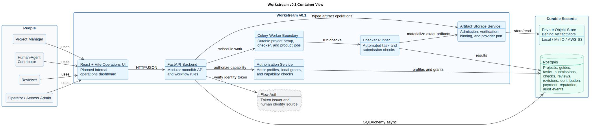

# Workstream v0.1 Container View

This is the 30-day implementation architecture. It shows the deployable containers and internal runtime boundaries for the current build.

Future external origins, ERC-8004, ERC-8183, x402, OmniClaw, and USDC settlement are not active v0.1 dependencies. They remain later adapters behind the same records and interfaces.

Source: [workstream_v01_container.puml](workstream_v01_container.puml)

## Container Responsibilities

| Container | Responsibility |
| --- | --- |
| React + Vite operations UI | Planned internal project, queue, task, submission, review, compensation, and reputation operations surfaces. |
| FastAPI backend | API contracts, workflow rules, auth dependency, lifecycle guards, module orchestration, audit writes. |
| Postgres | Record database for workflow state, policy context, submissions, checks, reviews, revisions, contribution records, compensation awards/receipts/projections, reputation events, and audit history. |
| Storage interface | Stable artifact boundary using local storage for focused development, MinIO for local/CI protocol proof, and AWS S3 for hosted v0.1. |
| Celery worker boundary | Durable project setup, checker, and background product-job execution path. FastAPI background tasks are not the Workstream product-job boundary. |

## v0.1 Guardrails

- Postgres is used locally, in CI, and in production-like development.
- Workstream verifies Flow auth tokens and does not manage primary authentication.
- Task rules lock to guide and policy versions so upstream changes do not silently mutate in-progress work.
- Task acceptance, contribution, compensation fulfillment, and reputation are
  separate records.
- External origins, agent identity writes, task escrow, and settlement rails remain adapter boundaries until the internal loop is proven.
